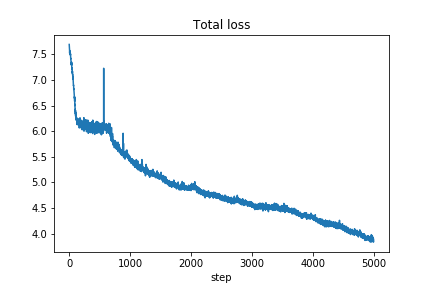
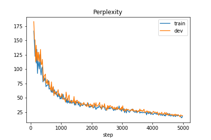
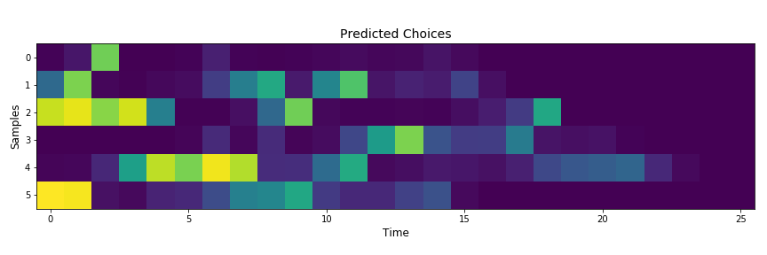
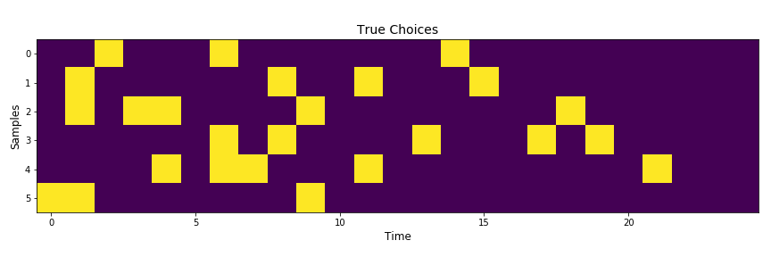

Sequence to Sequence with Attention in TensorFlow and Emotional Chatting Machine
======

About
--------

This project implements following models with the focus on easy-to-trace-and-understand implementations.

- **Sequence-to-sequence with Attention** ([Intro](https://guillaumegenthial.github.io/sequence-to-sequence.html)): A general encoder-decoder framework that is widely used in Natural Language Processing such as translation, summarization, conversational bot, and more.

- **Emotion Regression**: A bi-directional LSTM with self-attention that predicts emotion intensities of a sentence *[anger, fear, joy, sadness]*, proposed by Baziotis, Christos, et al. (2018) for solving SemEval-2018 Task 1.

- **Emotional Chatting Machine**: An end-to-end framework from H. Zhou (2018) that can generate emotional responses in open-domain conversational systems (emotional chatbots).

Features
--------

- Model Configuration: Support **YAML** format for easy configurations of model architecture.

- Easy-to-trace: Build pipeline components (encoder, decoder, attention, beam search) with proper annotations.

- Easy-to-understand: Focus on functional programming style which makes the workflow more understandable.

- Checkpoint Availability: Saving and loading of half-trained models are enabled (checkpoints).

- Jupyter Notebook: Demonstrate the whole example workflow in Jupyter notebooks to easily play with.

Example: Sorting of Integers
---------

See *example* folder for sample data.

### Model: Seq2seq with attention

**Embeddings**: 128-dimension, 1000 vocabulary size (integers from 0 to 999).

**Encoder-Decoder**: 2-layer bi-directional LSTM and 2-layer LSTM (256 hidden) with Bahdanau attention mechanism.

**Inference**: Beam search decoding, beam size 5. 

**Training**: Cross entropy loss, evaluated by perplexity.

| Training loss | Perplexity |
| --- | --- |
|  |  |

 

### Model: Emotional Chatting Machine

Prime numbers as simulated emotion words and they are equally split into **4** "emotion" categories.

Sequence with most primes from a certain category is tagged with that "emotion" category.

**Emotion Category Embeddings**: 32-dimensional vector for each emotion.

**Internal Memory**: 64-dimensional vector for each emotion.

**External Memory**: Explicitly promote emotion words against generic words.

| Training loss | Perplexity |
| --- | --- |
|  |  |

#### Predicted Choices for emotion words:

#### True Choices:

Usage
--------

Clone the repo and use the [virtualenv](http://www.virtualenv.org/):

    git clone https://github.com/AaronYALai/Seq2seqAttnTF

    virtualenv env3 -p python3

    source env3/bin/activate

    cd Seq2seqAttnTF

Install all requirements and run the model on example data and configuration:

    pip install -r requirements.txt

    python train.py

    python infer.py

Emotional Chatting Machine:

    python train_ECM.py

    python infer_ECM.py

The installation of TensorFlow GPU version:

    pip install tensorflow-gpu

Run up Jupyter Notebook for interactive executions ([Link](http://jupyter.org/index.html)):

    jupyter notebook

References
--------

- D. Bahdanau, K. Cho, Y. Bengio. "Neural Machine Translation by Jointly Learning to Align and Translate." ICLR 2015.

- H. Zhou, M. Huang, T. Zhang, X. Zhu, and B. Liu. "Emotional Chatting Machine: Emotional Conversation Generation with Internal and External Memory." AAAI 2018.

- Baziotis, Christos, et al. "NTUA-SLP at SemEval-2018 Task 1: Predicting Affective Content in Tweets with Deep Attentive RNNs and Transfer Learning." arXiv 2018.

- [Seq2seq with Attention Introduction](https://guillaumegenthial.github.io/sequence-to-sequence.html)

- [Google's Seq2seq with Attention](https://github.com/google/seq2seq)

- [Im2Latex](https://github.com/guillaumegenthial/im2latex)

- [SemEval-2018 Task 1](https://competitions.codalab.org/competitions/17751)
