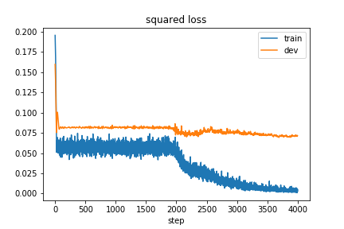
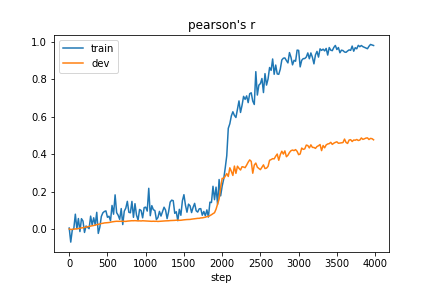

Emotion Regression
======

About
--------

An emotion regression model: A bi-directional LSTM with self-attention mechanism that can predict emotion intensities of a sentence *[anger, fear, joy, sadness]*, proposed by Baziotis, Christos, et al. (2018) for solving SemEval-2018 Task 1.

Tokenization is done by NLTK twitter tokenizer and experiments are run on dataset provided by [SemEval-2018 Task 1](https://competitions.codalab.org/competitions/17751).

**To-Do:** Pretrain model on the twitter sentiment classification task before fine-tune it on the emotion regression task.

Features
--------

- Model Configuration: Support YAML format for easy configurations of model architecture.

- Runnable Workflow: The whole workflow can readily be executed including preprocessing, training, and inference.

- Checkpoint Availability: Saving and loading of half-trained models are enabled using TensorFlow checkpoints.

- Jupyter Notebook: Demonstrate the whole example workflow in Jupyter notebooks for one to easily play with.

Usage
---------

The provided model has following configurations:

**Embeddings**: 128-dimensional embeddings with vocabulary size equal to number of tokens.

**Encoder**: 2-layer bi-directional LSTM with 256 hidden units.

**Self Attention**: 2-layer feed-forward network with 128 hidden units and tanh activations.

**Training**: Mean squared loss and evaluated by Pearson correlation coefficient (Pearson's r).

#### Sample training loss:

#### Sample Pearson's r:

**Note:** Can see the model is overfitting now. Pretraining on another large dataset might be necessary.

Execute the whole workflow including preprocessing, training, and inference:

    python emopreprocess.py

    python emotrain.py

    python emoinfer.py

Run up Jupyter Notebook for interactive experience with the model ([Link](http://jupyter.org/index.html)):

    jupyter notebook

References
--------

- Baziotis, Christos, et al. "NTUA-SLP at SemEval-2018 Task 1: Predicting Affective Content in Tweets with Deep Attentive RNNs and Transfer Learning." arXiv 2018.

- [SemEval-2018 Task 1](https://competitions.codalab.org/competitions/17751)
